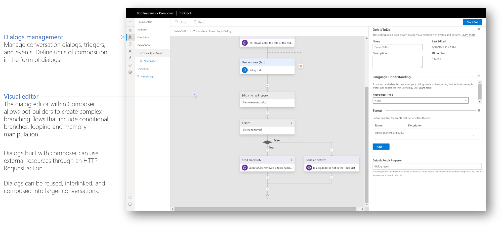
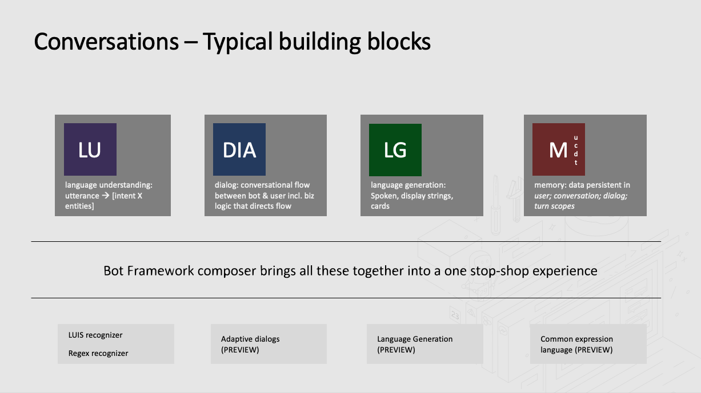

# Composer overview

## Lab content setup

> Before you start this lab, make sure you have the following set up.

- Bot framework composer installed. Verify by launching Edge browser and navigate to `http://localhost:3000`
- Bot Framework Emulator installed. Verify by launching Bot Framework Emulator.
- Cognitive Service Language Understanding authoring resource. To verify, click on `Environment details` tab in the integrated documentation pane. You should see non empty values for `LUIS authoring key 1` and `LUIS authoring key 2`.

## Bot Framework Composer

Bot Framework Composer is an integrated development tool for developers and multi-disciplinary team of professional conversation designers with a coding and business background to create, edit, test and refine conversational apps (bots)​. It includes: 

- A visual editing canvas for conversation flow​
- In context editing for language understanding (NLU) ​
- Tools to train and manage language understanding (NLU)  and QnA components​
- Integration with Language generation system​
- A ready-to-use bot runtime executable​

​Bot Framework Composer is: 

- Based on the Bot Framework SDK Adaptive Dialogs and Declarative file formats ​
- Open source​
- A web app designed to run locally and in cloud-environments ​
- Designed as an extensible solution both at dialog composition (actions/ skills) and composer tools and workflows​

## Workshop outline

In this workshop, you will learn to build a `Weather bot` using Bot Framework Composer. 
This workshop is structured to start simple and quickly layer in sophisticated concepts and will cover the following areas - 

- Create a new Bot
- Author a new dialog
    - Triggers - Language Understanding (powered by [LUIS.ai][1])
    - Actions
- Using different actions to model conversation flow
    - HTTP Action
- Add global help, cancel handling
- Use language generation to power your bot's responses
- Building and responding with adaptive cards
- Handling interruptions in the conversation flow
- Author more than one dialog that help your bot fulfill more than one scenario 
​
## Building blocks

We will cover the following building blocks as we create a `Weather bot` using Bot Framework Composer.

[1]:https://www.luis.ai/