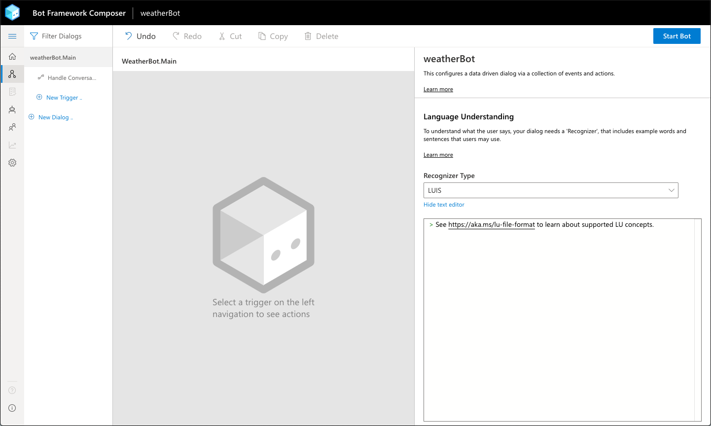
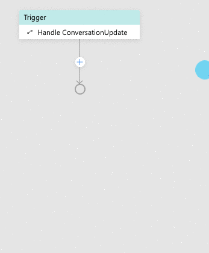

# Create the Weather Bot

The first step to creating a bot with Bot Framework Composer is
creating a new bot project from the home screen. This will create a
new folder on your computer with all the files necessary to build, test and run the bot.

## Create Project

From the home screen, select `New` from the upper left corner.
You'll be presented with a dialog with options to either create an empty bot project from scratch, or to create one based on a template.

For this workshop, make sure `Create from Scratch` selected and click `Next`

The second screen asks for a `Name` and `Description` of your bot.

During this workshop, we'll be making a bot that talks about the weather, so let's call it `weatherBot` and give it a description of `a friendly bot who can talk about the weather.`

> Make sure not to put any spaces or special characters in the bot's name.

Leave the `Location` field with its default value - this will put the bot project into Composer's default project folder where it will be easy to find.  Click `Next`, and Composer will create the project for you!

## Give your bot something to say

After creating your bot, Composer will load the new bot's `Main` dialog in the editor.  It should look like this:

Each dialog contains one or more `Triggers` that define the actions available to the bot while the dialog is active. Right now the dialog is empty, so the bot won't do anything.

Let's add a trigger so that the bot will send a greeting message to users when they connect. Click the `+ New Trigger` button in the left hand explorer.

You'll see dialog box with a list of trigger types. To trigger a greeting, select `Handle ConversationUpdate`.  This type of trigger occurs when a user first opens a chat window and connects to the bot.

Submit the dialog box, and you'll see a new `flow` has been added to the dialog. 

To help keep the bot organized, let's rename this trigger to something that describes what it does.

In the `property editor` on the right side of the screen, click on the name of the trigger ("Handle ConversationUpdate"). You'll be able to update the title there, and the change will be instantly reflected in the dialog and navigation on the left.

Rename ths trigger to `WelcomeTheUser`.

Now, let's actually make the bot do something! 
Inside the flow, you'll see that the teal `Trigger` box has a line below it that includes in a "+" button.

The "+" button can be used to add an action at the given point in the dialog flow. You can use this to add actions to the end of a flow, or insert actions at an earlier point.

For now, let's instruct the bot to send a simple greeting.

Click the "+" button and select the first menu item `Send Messages`, and then selec the first item from the sub-menu: `Send an Activity`

Select the new `Send an Activity` action in the flow and it's properties will appear on the right hand side of the screen.  This action has only one main property - the text of the activity to send.

Type a welcome message into this field. It is always a good idea to have your bot introduce itself and explain it's main features.  So let's make the welcome message something like:

`Hi! I'm a friendly bot that can help with the weather. Try saying WEATHER or FORECAST.`

Your bot should now look like this:

# Start your bot and test it

Now that our new bot has its first simple feature, let's launch it in the emulator and make sure everything works.

Click the `Start Bot` button in the upper right hand corner of the screen.  This tells Composer to launch the bot's runtime (an external app powered by the Bot Framework SDK) and updates it with the latest content and settings from Composer.

After a few seconds, a second link will appear next to the button thats `Test bot in emulator`.  Click this link to open Emulator and connect.

You should see a window like this appear:

And the bot should immediately greet you with the message we just configured:

We now have a working bot, and we're ready to add some more substantial functionality!