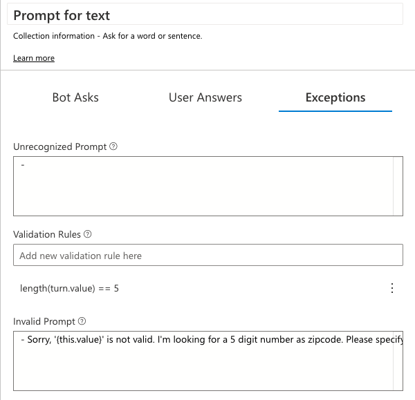

# Get the Weather

1. In the explorer, click on `getWeather` to select the dialog and reveal the triggers it contains.
2. Click on the `BeginDialog` trigger underneath getWeather.

The first thing we need to do to check a user's local weather is collect the user's location. Our weather API accepts a 5 digit zipcode as a parameter.

So, let's prompt the user for a zipcode.

3. Click the "+" button in the flow and select `Ask a Question >`. You'll see a variety of options for asking for different types of input.
4. Select `Prompt for text` from the sub-menu. 2 new nodes will appear in the flow, the first representing the bot's question, and the second representing the user's response.


5. Click on the `Bot Asks` node, and in the property editor, set the prompt to:
```
What is your zipcode?
```


6. Next, click the `User Answers` tab in the property editor.


7. Here, we can specify what property in memory will be used to store the user's response. In `Property to fill`, enter the value:
      ```
      user.zipcode
      ```

      For `Output Format`, select `trim`


8. Click on the `Exceptions` tab in the property editor.


9. In the `Unrecognized Prompt` field, enter:
      ```
      - Please specify a zipcode in the form #####
      ```

      In the `Invalid Prompt` field, also enter:
      ```
      - Please specify a zipcode in the form #####
      ```

10. In `Validation Rules`, type:
      ```
      length(turn.value) == 5
      ```

      and then press enter.

      > Make sure to press enter to add the rule!

Your properties pane should look like this:



And your flow should look like this:


HTTP action
- wire up to a HTTP endpoint
- passing bot state in HTTP request body
- handling HTTP response