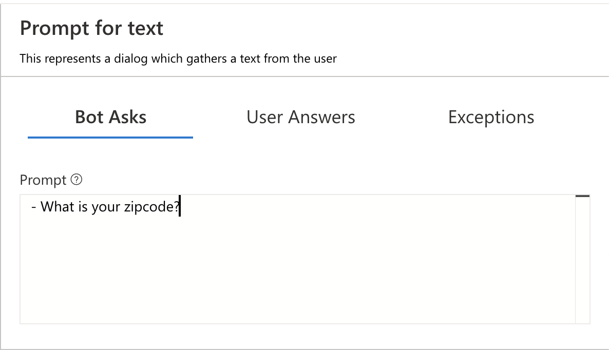
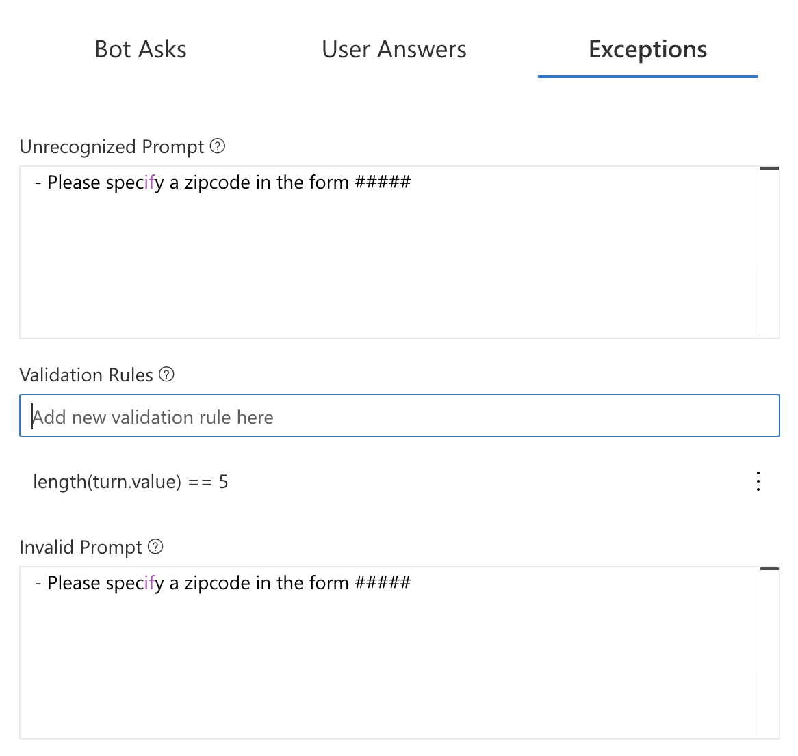

# Get the Weather

1. In the explorer, click on `getWeather` to select the dialog and reveal the triggers it contains.
2. Click on the `BeginDialog` trigger underneath getWeather. The first thing we need to do to check a user's local weather is collect the user's location. Our weather API accepts a 5 digit zipcode as a parameter. So, let's add a `Text Input` to prompt the user for a `zipcode`.
3. Click the "+" button in the flow and select `Ask a Question >`. You'll see a variety of options for asking for different types of input.
4. Select `Text Input` from the sub-menu. 2 new nodes will appear in the flow!

   > You use prompts to collect information from user. Prompt are broken down into a few pieces. We'll configure each separately.

   

5. Click on the `Bot Asks` node. This part of the prompt represents the message the bot will send to the user requesting information. In the property editor set the prompt to:

      `What is your zipcode?`

   > By default prompts are configured to ask the user for information `Max turn count` number of times (defaults to 3). When this happens, the prompt will stop and set the `Default value` to the `Property` and move forward with the conversaiton. 

   

6. Next, click the `User Answers` tab in the property editor. This part of the prompt represents the user's response, including where to store the value and how to pre-process it.

   

7. Here, we can specify what property in memory will be used to store the user's response. In `Property to fill`, enter the value:

      `user.zipcode`

   

8. Click on the `Exceptions` tab in the property editor. This section allows you to specify validation rules for the prompt, as well as error messages that will be used if the user provides an invalid response.

   

9. In `Validation Rules`, type:

      `length(this.value) == 5`

    and then press enter.

    > This validation rule says the input must contain five characters

    > Make sure to press enter to add the rule!

10. In the `Invalid Prompt` field, also enter:

      `- Sorry, '{this.value}' is not valid. I'm looking for a 5 digit number as zipcode. Please specify a zipcode in the form 12345`

    Your properties pane should look like this:

    

    And your flow should look like this:

    

    With these options set, we have a dialog that will prompt the user for a zipcode. If the user gives a valid 5 digit zipcode, the prompt will store the value in `user.zipcode` and move on. If the user gives an invalid zipcode (e.g. `tomato` or `123456`), the prompt will present an error message and repeat until a valid response is received.

    > There are some options in the footer of the prompt properties that can be used to tune how the prompt works.

    > Max turn count can be used to control how many times the bot will reprompt after invalid responses.

    > By default, prompts will be skip if the bound property already has a value. Always prompt, when enabled, will cause the prompt to appear even if the value is already known. Leave this unchecked for now.

    After this action occurs, the bot can use `{user.zipcode}` in messages, and more importantly, in calls to external APIs!

11. Finally, add a `Send a response` action to the bottom of the flow to echo back the zipcode to the user.

12. Set the text action of this action to:

      `Let's get the weather for {user.zipcode}`

## Test in Emulator

1. Restart the bot again, and open it in emulator.

   

2. After the greeting, send `weather` to the bot. The bot will prompt you for a zipcode. Give it an INVALID zipcode like 1234 or ABCD. You should see the the invalid prompt.

3. Now, give it a real zipcode like `78704`.  You should see `Let's get the weather for 78704`

## Covered in this section

- Prompting user for information
