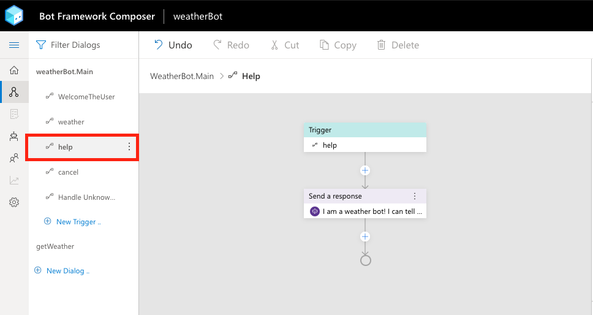
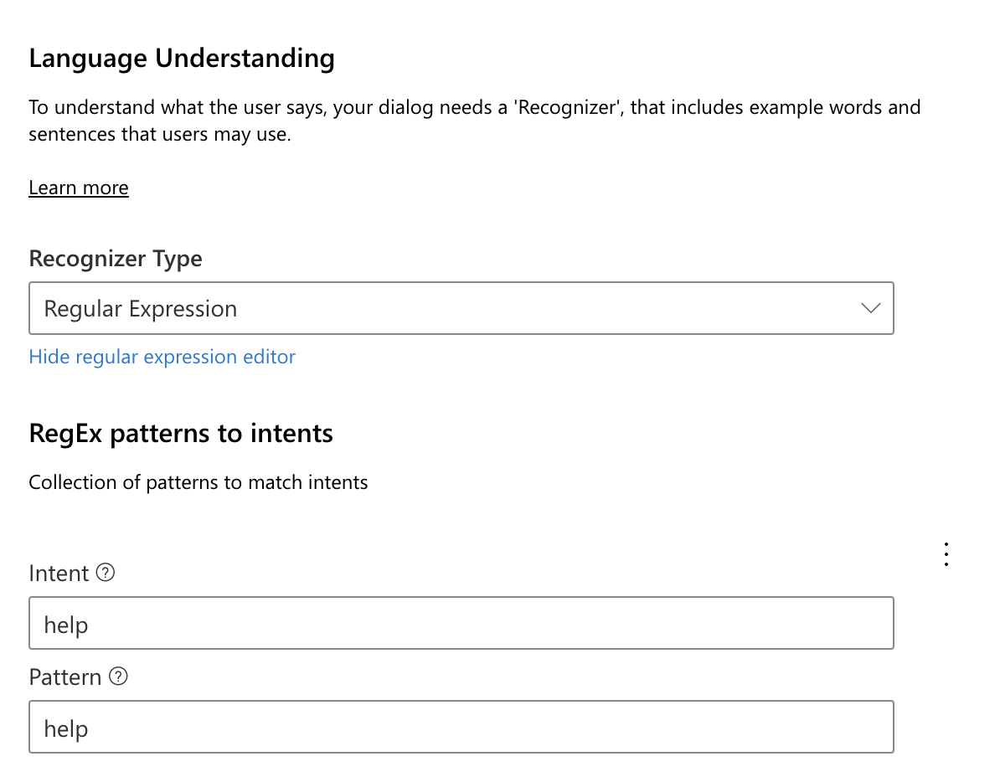
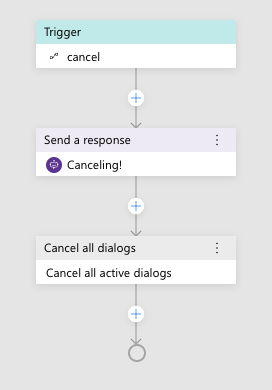
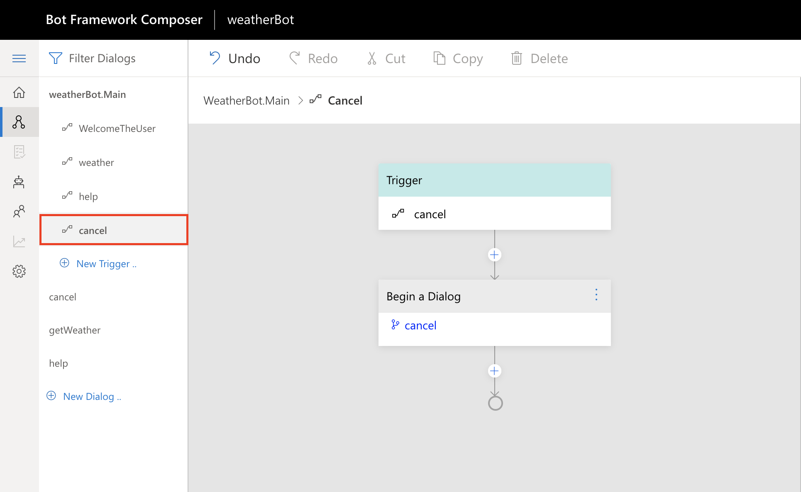

# Add Help and Cancel

With even a simple bot, it is a good practice to provide a help command. You'll also want to provide a way for users to back out. 

1. Click `+ New Dialog` in the left hand explorer. You'll see a popup window.
2. Give this new dialog the name:

      `help`

   

3. Click submit, and you'll land in the editor view for the new help dialog. 

   

   Composer created this new dialog with no triggers or actions defined. So let's go ahead and add a trigger for actions to execute when this dialog begins. 
4. Click on `+ New Trigger` in the left navigation pane. 
5. Select `Handle a Dialog Event` for `What is the type of this trigger?` and select `Handle and event: BeginDialog` for `What is the event?`. Click `Submit` 

   > `BeginDialog` event is automatically fired by adaptive dialog when this dialog is invoked.

   

6. Let's give this trigger a shorter name - type `BeginDialog` in the right property editor. 

    

7. Use the `+` button at the bottom of the flow, choose `Send a response`
8. In the property editor on the right side, set the text of the activity to:

      `I am a weather bot! I can tell you the current weather conditions. Just say WEATHER.`

   

   Next, let's wire this new dialog up to the Main dialog (your bot's brain).

9. In the left hand explorer, click on `weatherBot.Main` at the top of the list.
10. In the right hand property pane, find the "Language Understanding" section and click the "Add" button at the bottom. This will reveal 2 new fields, allowing you to define a new intent.
11. Set the `Intent` field to:

      `help`

      Set the `Pattern` field to: 

      `help`

      

12. In the left hand explorer, click `+ New Trigger'
13. In the resulting dialog box, select `Handle an Intent`, then choose the new `help` intent. Submit the dialog.

      

14. In the flow editor, click the `+` button at the bottom of the empty flow.
15. Choose `Dialogs management >` and then select `Begin a new dialog`

      

16. In the right hand property editor, select the `help` dialog.

      

17. Click `Reload bot` and open it in the emulator.

----

Now, in addition to giving you the current weather, your bot can also offer help.

However, notice that once you start the weather dialog by saying weather, your bot doesn't know how to provide help. Let's fix this!

---

## Allowing interruptions

18. In Composer's left hand explorer, navigate back to the `getWeather` dialog. Make sure to highlight the `BeginDialog` trigger.
19. Select the `Bot Asks` node in the flow that says `What is your zipcode?`
20. In the right hand property editor, set `Allow Interruptions` to `true`
   

   > This tells Bot Framework to consult the parent dialog's recognizer, which will allow the bot to respond to `help` at the prompt as well.

21. Hit `Reload Bot` and open it in the emulator.

---

Say `weather` to your bot.  It will ask for a zipcode.

Now say `help`. It'll provide the global help response, even though that intent and trigger are defined in another dialog. Interruptions are a powerful way to make complex bots - we'll come back to that later.

For now, let's add one more global function - a cancel command.

---

## Global cancel

22. In Composer's left hand explorer, click the `+ New Dialog` button again. 
23. Give this new dialog the name:

      `cancel`

> Do you remember how to add a `BeginDialog` trigger to this newly created dialog? 

You will need to add a `BeginDialog` trigger to this newly created dialog. See [here](#create-begin-dialog-trigger) to juggle your memory and add a `BeginDialog` trigger to this dialog and continue through the next set of steps.

24. Use the `+` button at the bottom of the flow, choose `Send a response`
25. In the property editor on the right side, set the text of the activity to:

      `Canceling!`

26. Use the `+` button again, this time choose `Dialog management >`, then `Cancel all dialogs`

      > When triggered, this will cause the bot to cancel any active dialogs, and send the user back to the main dialog.

       

27. In the left hand explorer, click on `weatherBot.Main` at the top of the list.
28. In the right hand property pane, find the "Language Understanding" section and click the "Add" button at the bottom. This will reveal 2 new fields, allowing you to define a new intent.
29. Set the `Intent` field to:

      `cancel`

      Set the `Pattern` field to:

      `cancel`

30. In the left hand explorer, click `+ New Trigger'
31. In the resulting dialog box, select `Handle an Intent`, then choose the new `cancel` intent. Submit the dialog.
32. In the flow editor, click the `+` button at the bottom of the empty flow.
33. Choose `Dialog management >` and then select `Begin a new dialog`
34. In the right hand property editor, select the `cancel` dialog.

       

35. Click `Reload bot` and open it in the emulator.

---

Say `weather` to your bot.  It will ask for a zipcode.

Now say `help`. It'll provide the global help respons.

Now, say `cancel` - notice, the bot doesn't resume the weather dialog. Instead, it confirms the cancelation, and waits for your next message.

## Covered in this section
- Adding additional dialogs
- Global flow control operations
    - Help
    - Cancel
- Allow interruptions while in the middle of a conversation