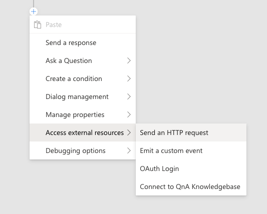

# Add an HTTP request

Now, we're going to continue to build out the weather dialog. Head back to Composer, and make sure the `getWeather` dialog is higlighted on the left.

The http request action is found under the `Access external resources >` menu in the flow "+" button.

1. Select `Send an HTTP request` to add a the step to your flow.

   

2. In the properties editor,

   Set the method to `GET`

   Set the url to:    

      `http://weatherbot-ignite-2019.azurewebsites.net/api/getWeather?zipcode={user.zipcode}`

   Set the Result property to:

      `dialog.api_response`

   

   This will cause the bot to make an HTTP request to the url specified. The reference to `{user.zipcode}` will be replaced by a live value from the bot's memory.

   > HTTP action sets the following information in the `Result property`: statusCode, reasonPhrase, content, headers. Setting the `Result property` to `dialog.api_response` means we can access those values via `dialog.api_response.statusCode`, `dialog.api_response.reasonPhrase`, `dialog.api_response.content` and `dialog.api_response.headers`. If the response is json, it will be a deserialized object available via `dialog.api_response.content`.

   After making an HTTP request, we need to test the status of the response. To do this, we'll use an If/Else branch.

3. Use the '+' button, then choose `Create a condition`, then choose  `Branch: If/Else`
4. In the property editor on the right, set the `condition` field to:

      `dialog.api_response.statusCode == 200`

5. In the `true` branch, use the "+" button, then select `Manage properties >`, then `Set a Property`

   Set Property to:
   
      `dialog.weather`

   Set Value to:

      `dialog.api_response.content`

   

6. Still in the `true` branch, use the "+" button, then select `Send a response`

   Set the text of the message to:
   
      `The weather is {dialog.weather.weather} and the temp is {dialog.weather.temp}&deg;`

   

7. Now, in the `false` branch, use the "+" button, then select `Send a response`

   Set the text of the message to:
   
      `I got an error: {dialog.api_response.content.message}`

8. To be safe, let's clean up the invalid value which otherwise would persist. Use the "+", select `Manage properties >`, then select `Delete a property`

   Set the property to:

      `user.zipcode`

   

## Test in Emulator

1. Restart the bot again, and open it in emulator.

   

2. After the greeting, send `weather` to the bot. The bot will prompt you for a zipcode. Give it your home zipcode, and seconds later, you should see the current weather conditions!

   

   If you ask for the weather again, notice that the bot doesn't prompt for a zipcode the second time. Remember, this is because `user.zipcode` is already set. Had we checked `always prompt,` the bot would ask each time. Go back to step 10, check `Always prompt` and try again! Your bot will ask for a zipcode everytime you re-start the conversation in emulator.

## Covered in this section

- Adding and configuring HTTP action to make HTTP requests
- Representing branches in conversation flow
- Dealing with memory
