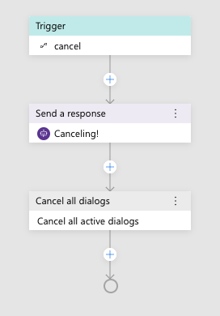

# Add Help and Cancel

With even a simple bot, it is a good practice to provide a help command. You'll also want to provide a way for users to back out. 

--

1. In the left hand explorer, click on `weatherBot.Main` at the top of the list.
2. In the right hand property pane, find the "Language Understanding" section and click the "Add" button at the bottom. This will reveal 2 new fields, allowing you to define a new intent.
3. Set the `Intent` field to:

      `help`

      Set the `Pattern` field to: 

      `help`

      

4. Click the "Add" button again.
5. Set the `Intent` field to:

      `cancel`
      
      Set the `Pattern` field to:

      `cancel`

6. In the left hand explorer, click `+ New Trigger'
7. In the resulting dialog box, select `Handle an Intent`, then choose the new `help` intent. Submit the dialog.

      

3. Use the `+` button at the bottom of the flow, choose `Send a response`
4. In the property editor on the right side, set the text of the activity to:

      `I am a weather bot! I can tell you the current weather conditions. Just say WEATHER.`

   

5. In the left hand explorer, click `+ New Trigger'
6. In the resulting dialog box, select `Handle an Intent`, then choose the new `cancel` intent. Submit the dialog.
7. Use the `+` button at the bottom of the flow, choose `Send a response`
8. In the property editor on the right side, set the text of the activity to:

      `Canceling!`

5. Use the `+` button again, this time choose `Dialog management >`, then `Cancel all dialogs`

      > When triggered, this will cause the bot to cancel any active dialogs, and send the user back to the main dialog.

       

---

## Allowing interruptions

1. In Composer's left hand explorer, navigate back to the `getWeather` dialog. Make sure to highlight the `BeginDialog` trigger.
2. Select the `Bot Asks` node in the flow that says `What is your zipcode?`
3. In the right hand property editor, set `Allow Interruptions` to `true`
   

   > This tells Bot Framework to consult the parent dialog's recognizer, which will allow the bot to respond to `help` at the prompt as well.

4. Hit `Reload Bot` and open it in the emulator.

---

Say `weather` to your bot.  It will ask for a zipcode.

Now say `help`. It'll provide the global help response, even though that intent and trigger are defined in another dialog. 

Now, say `cancel` - notice, the bot doesn't resume the weather dialog. Instead, it confirms the cancelation, and waits for your next message.

## Covered in this section
- Adding additional dialogs
- Global flow control operations
    - Help
    - Cancel
- Allow interruptions while in the middle of a conversation
